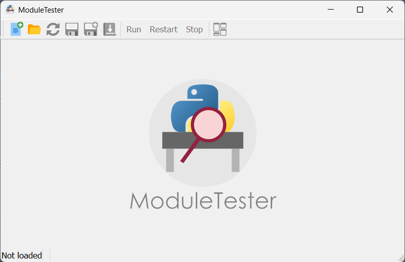
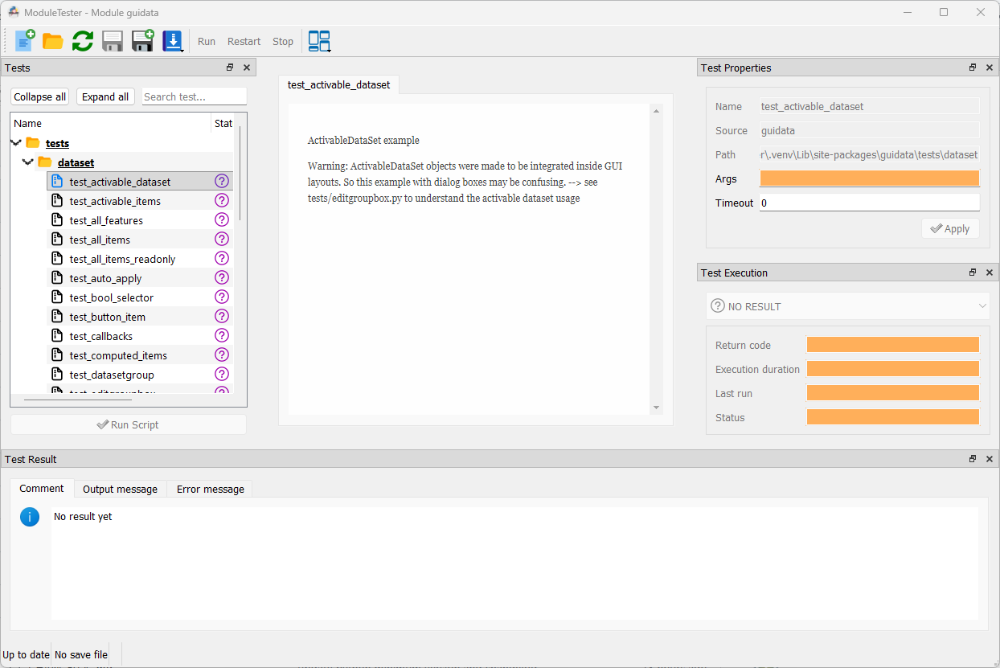

Example
=======

   ModuleTester main window with dockable panels and tree view navigation

   Running tests on the ``guidata`` package — tree view with status icons, test
   properties, and execution results panels
